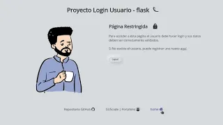

# Proyecto Login Usuario

Proyecto sencillo usando el framework Flask sobre Login de Usuario con base de datos MySQL.

La app muestra en funcionamiento básico de un sistema de login 
para usuarios y sesiones.

### Portada (home)
+ Página de bienvenida, muestra una breve explicación del Proyecto.
+ De haber un usuario conectado, éste aparecerá debajo de la imagen 
del avatar y un botón de logout.
+ Brinda las opciones de Login y Registro, botones que redirigen a las 
respectivas secciones.
+ En el menú inferior se muestra el link para una página restringida, a la cual sólo puede ingresarse si el usuario hace login correctamente.

### Login
+ Acé se solicitan los datos básicos al usuario para acceder, como lo son 
    + nombre de usuafio
    + password o contraseña
+ En el momento de que el usuario logre loguearse, será redirigido a home

### Registro
+ Sección que permite el registro de nuevos usuarios en el caso de no estar registrados
+ solicita datos como:
    + nombre completo del usuario
    + usuario o palabra de como quiere ser identificado en la app
    + email o correo electrónico
    + password o contraseña para su ingreso

Requerimientos:

+ blinker==1.7.0
+ click==8.1.7
+ dnspython==2.4.2
+ email-validator==2.1.0.post1
+ Flask==3.0.0
+ Flask-Login==0.6.3
+ Flask-MySQLdb==2.0.0
+ Flask-WTF==1.2.1
+ idna==3.6
+ itsdangerous==2.1.2
+ Jinja2==3.1.2
+ MarkupSafe==2.1.3
+ mysqlclient==2.2.0
+ Werkzeug==3.0.1
+ WTForms==3.1.1

### Estructura de tabla

id: smallint(3) autoincrement
nombre: varchar(60)
usuario: varchar(50)
email: varchar(50)
password: char(255)

